# TENORA PROPERTY BILLING MASTER PLAN

## 0. Purpose

This document is the implementation contract for evolving Tenora from a generic multi-tenant SaaS billing platform into a property/workspace billing platform.

Claude Code should treat this file as the source of truth for the property-management/domain expansion described here.

Do not implement this entire document blindly before first inspecting the current repository. The existing architecture, tests, migrations, authentication, tenant isolation, platform controls, plan/subscription system, and gateway abstraction must be preserved unless this document explicitly requires a change.

The goal is to provide enough product, domain, architecture, authorization, data-model, API, billing, UI, testing, migration, and implementation guidance that a future Claude Code session can execute the work in one long autonomous session with minimal follow-up prompts.

---

# 1. Product Definition

Tenora has TWO distinct financial domains.

## 1.1 Tenora platform subscription billing

The property owner/workspace owner pays Tenora for using the Tenora software.

Example:

    Workspace: Sunrise Apartments
    Owner: Property Owner
    Tenora Plan: Professional
    Tenora Subscription: ₹1,999/month

The residents of Sunrise Apartments do NOT pay Tenora for the workspace subscription.

## 1.2 Property billing

The workspace owner uses Tenora to manage money owed by residents to the property owner.

Example:

    Resident: Rahul Sharma
    Unit: 203
    Monthly rent: ₹12,000
    Electricity: ₹1,280
    Maintenance: ₹500
    Total bill: ₹13,780

This ₹13,780 is owed to the property owner/workspace, not to Tenora.

These two billing systems must remain conceptually and technically separate.

    OWNER --------------------> TENORA
             Tenora subscription

    RESIDENT -----------------> OWNER / WORKSPACE
             property bill

The platform administrator can have global visibility over both domains according to operator/root permissions.

---

# 2. Important Terminology

The current Tenora codebase uses `Tenant` for the customer's workspace. Do not introduce a second meaning of "tenant" for apartment residents.

For the property-management domain use these concepts:

| Concept | Preferred terminology |
|---|---|
| Tenora customer workspace | Workspace |
| Existing internal customer model | Existing `Tenant` model, unless safely renamed later |
| Person who pays Tenora | Workspace Owner |
| Physical building / property | Property |
| Apartment / room / rentable space | Unit |
| Person occupying a unit | Resident |
| Contract/occupancy association | Lease / Occupancy |
| Electricity hardware/account | Meter |
| Meter measurement | Meter Reading |
| Amount owed for a billing period | Bill |
| Individual amount inside a bill | Bill Line Item / Charge |
| Money received against a bill | Payment |
| Proof of payment | Receipt |

Do not create a model named `Tenant` to represent residents unless a future explicit architecture decision changes this terminology.

---

# 3. Core Domain Hierarchy

The target domain hierarchy is:

    Platform
      |
      +-- Workspace (existing Tenora customer tenant)
            |
            +-- Property
                  |
                  +-- Unit
                        |
                        +-- Resident
                        |
                        +-- Lease / Occupancy
                        |
                        +-- Meter
                              |
                              +-- Meter Reading
                        |
                        +-- Monthly Bill
                              |
                              +-- Bill Line Items
                              |
                              +-- Payments
                              |
                              +-- Receipts

A workspace may eventually own multiple properties.

Example:

    Workspace: ABC Property Management
      |
      +-- Sunrise Apartments
      |     +-- Unit 101
      |     +-- Unit 102
      |     +-- Unit 103
      |
      +-- Green Valley Apartments
            +-- Unit A1
            +-- Unit A2

The first implementation must not assume a workspace can contain only one building.

---

# 4. Roles and Access Model

There are three primary application roles.

## 4.1 Platform Administrator / Root

This is the Tenora operator/admin.

Can, subject to existing platform permission architecture:

- view all workspaces
- view all properties
- view all units
- view all residents
- view all leases/occupancies
- view all meters/readings
- view all bills
- view all payments
- view all receipts
- view platform subscription information
- view aggregated billing/collection metrics
- perform existing platform-level controls

Existing root/operator permission rules remain authoritative.

Do not weaken the existing operator permission boundaries.

### 4.1.1 Platform-admin owner promotion/demotion

The platform administrator/root may promote or demote workspace-owner/manager accounts regardless of the Tenora plan they purchased. Plan tier must never be used as an authorization barrier for platform administration.

Subject to the existing root/operator safety rules, the platform admin may:

- promote an eligible user to workspace-owner/manager state
- demote a workspace owner/manager
- suspend or deactivate accounts using the existing platform controls
- inspect the resulting workspace, subscription, and property-billing state

Promotion/demotion must respect the existing last-root invariant and platform role rules and must be audited.

## 4.2 Workspace Owner / Workspace Manager

This is the paying Tenora customer and operator of their own workspace.

Can manage only data belonging to their workspace:

- properties
- units
- residents
- leases/occupancies
- meters
- meter readings
- rents
- billing configurations
- monthly bills
- payment records
- receipts
- relevant billing reports

They cannot see another workspace's property data.

## 4.3 Resident

A resident is NOT a Tenora subscription customer.

A resident can be a member of one or more workspaces only through an explicit invitation/acceptance flow. A workspace owner must never be able to silently add a user's account as a resident/member without the user's confirmation.

A resident can only access their own permitted property information:

- own profile
- own unit
- own active lease/occupancy
- own meter/billing information where applicable
- own bills
- own payments
- own receipts
- historical own bills/receipts according to retention rules

A resident must never be able to access another resident's records by changing an ID in the URL/API request.

Cross-resident access should fail through backend authorization, not merely frontend hiding.


### 4.4 Workspace invitations and membership acceptance

Workspace membership must be consent-based.

The owner/manager may create an invitation for a user to become a resident/member, but creation of an invitation is not the same as membership becoming active.

Required flow:

    Owner selects/adds resident
        -> invitation is created
        -> invited user receives an in-app notification
        -> invited user opens Notifications
        -> user reviews workspace/property/unit invitation details
        -> user chooses Accept or Decline

Only after **Accept** does the membership/occupancy association become active.

Requirements:

- no workspace owner may silently attach an existing user account to their workspace
- pending invitations must have an explicit pending state
- accepted invitations become active membership only after user confirmation
- declined invitations must not create active membership
- expired/cancelled invitations must not create membership
- invitation acceptance must be idempotent
- invitation acceptance must be authorized against the authenticated invited user
- users must be able to distinguish pending, accepted, declined, and expired invitations
- the notification itself is the in-app control point; an email is optional and must not be required for correctness
- the system must record when an invitation was created, accepted, declined, cancelled, or expired

After a resident accepts a workspace invitation, the application must treat that user as a resident/member for the workspace and switch that user's available application capabilities accordingly.

---

# 5. Multi-Tenant Isolation Requirements

The existing Tenora tenant-isolation architecture is locked unless a concrete compatibility change is required.

Maintain the following principles from `CLAUDE.md` and existing implementation:

- tenant/workspace resolution is performed through the existing authentication architecture
- tenant-owned querysets use the existing tenant-scoped data access mechanism
- `tenant_id` must not be accepted from untrusted request bodies to select the workspace
- cross-workspace object access must not leak information
- mutations go through service-layer/domain logic where the existing architecture requires it
- platform/global endpoints remain explicitly allow-listed
- object IDs from other workspaces must not reveal whether the object exists
- database constraints are part of correctness, not just application checks

All new property-domain models must have an unambiguous workspace ownership path.

Recommended ownership pattern:

    Property -> Workspace
    Unit -> Property (and therefore Workspace)
    Resident -> Workspace
    Lease -> Workspace + Unit + Resident
    Meter -> Workspace + Unit
    Meter Reading -> Meter + Workspace
    Bill -> Workspace + Resident + Unit + Billing Period
    Bill Line Item -> Bill
    Payment -> Workspace + Bill
    Receipt -> Workspace + Payment + Bill

Where useful for security/performance, explicitly storing `workspace/tenant` foreign keys on child entities is acceptable, provided consistency is enforced.

Do not duplicate ownership fields casually. Every denormalized workspace field requires a correctness invariant.

---

# 6. Proposed Domain Models

Before implementing, inspect existing models and choose the smallest compatible design. Do not create duplicate concepts that already exist.

The following is the target conceptual model, not permission to blindly create every field exactly as written.

## 6.1 Property

Represents a physical building/property managed by a workspace.

Suggested fields:

    id
    workspace / tenant
    name
    address_line_1
    address_line_2 (optional)
    city (optional)
    state (optional)
    postal_code (optional)
    country (default India only if existing product conventions support it)
    code/reference (optional)
    is_active
    created_at
    updated_at

Requirements:

- belongs to exactly one workspace
- property names need not be globally unique
- do not allow cross-workspace collisions to cause authorization ambiguity
- deactivation must preserve historical bills

## 6.2 Unit

Represents an apartment, room, shop, or rentable space.

Suggested fields:

    id
    property
    workspace / tenant if justified by architecture
    unit_number / identifier
    floor (optional)
    unit_type (optional)
    status
    created_at
    updated_at

Possible status values:

    VACANT
    OCCUPIED
    MAINTENANCE
    INACTIVE

Requirements:

- unit belongs to one property
- unit identifier should be unique within a property
- deleting a unit should not destroy historical billing records
- prefer archive/deactivate over destructive deletion once billing history exists

## 6.3 Resident

Represents the person occupying a property unit.

Reuse the existing User model where appropriate rather than duplicating authentication identity.

Potential design:

    User = global identity
    Resident profile = property-domain profile linked to User

Suggested resident-specific fields:

    user
    workspace / tenant
    phone (only if existing user/profile architecture does not already own it)
    display_name only if necessary
    resident reference/code (optional)
    status
    created_at
    updated_at

Important:

Do not create duplicate passwords/authentication records for residents.

The resident should use the existing authentication framework.

## 6.4 Lease / Occupancy

Represents the relationship between a resident and a unit over time.

Suggested fields:

    id
    workspace / tenant
    unit
    resident
    start_date
    end_date (nullable for current occupancy)
    monthly_rent
    security_deposit (optional future/phase field)
    status
    created_at
    updated_at

Possible status:

    DRAFT
    ACTIVE
    ENDED
    CANCELLED

Important historical rule:

Bills must not depend on mutable current resident/unit configuration after the bill is issued.

At bill creation/publication, preserve the necessary snapshot values so a later rent change or resident change does not rewrite historical billing.

Do not allow overlapping active leases for the same unit unless the product explicitly supports multiple occupants/co-tenants.

## 6.5 Meter

Represents an electricity meter associated with a unit.

Suggested fields:

    id
    workspace / tenant
    unit
    meter_number
    utility_type (initially ELECTRICITY)
    unit_of_measure (initially kWh or generic units depending on existing product terminology)
    multiplier (default 1 where useful)
    is_active
    installed_at (optional)
    created_at
    updated_at

A unit may eventually have multiple meters. Do not hard-code a one-meter-per-unit assumption into the schema unless required for MVP simplicity.

## 6.6 Meter Reading

Represents a timestamped reading.

Suggested fields:

    id
    workspace / tenant
    meter
    reading_date / reading_at
    reading_value
    source/manual-entry metadata if needed
    notes (optional)
    created_at
    updated_at

Requirements:

- reading values should not be negative
- historical readings should be retained
- do not permit a later reading to imply negative consumption unless a correction workflow explicitly exists
- uniqueness/ordering rules must prevent ambiguous duplicate readings for the same meter and billing period
- corrections should be auditable

Consumption calculation:

    consumption = closing_reading - opening_reading

If a meter multiplier exists:

    billed_units = (closing_reading - opening_reading) * multiplier

The implementation must define rounding/precision explicitly.

## 6.7 Billing Configuration / Tariff

Electricity pricing should be represented as configuration rather than hard-coded in bill generation.

MVP may use a simple per-unit rate.

Suggested conceptual fields:

    workspace
    utility_type
    rate_per_unit
    effective_from
    effective_to (nullable)
    is_active

A later version can support slabs/tiered rates.

For MVP:

    electricity_charge = consumed_units * rate_per_unit

When a bill is created, snapshot the applicable rate into the bill line item.

Changing the current tariff must not rewrite historical bills.

## 6.8 Bill

Represents the amount due for one resident/unit and one billing period.

Suggested fields:

    id
    workspace / tenant
    property
    unit
    resident
    lease (optional but strongly preferred)
    billing_period_start
    billing_period_end
    due_date
    status
    subtotal
    adjustments
    total
    published_at
    created_at
    updated_at

Possible status lifecycle:

    DRAFT
    ISSUED / PUBLISHED
    PARTIALLY_PAID
    PAID
    OVERDUE
    CANCELLED

The exact enum naming should match existing Tenora conventions.

Core invariant:

A bill belongs to exactly one workspace and one billing period.

For MVP, normally enforce at most one active/published bill for the same resident/unit + billing period unless a revision/credit-note model explicitly exists.

Do not silently generate duplicate monthly bills.

## 6.9 Bill Line Item

Represents a component of the bill.

Suggested types:

    RENT
    ELECTRICITY
    MAINTENANCE
    OTHER_CHARGE
    DISCOUNT
    ADJUSTMENT
    LATE_FEE

Suggested fields:

    bill
    type
    description
    quantity (nullable)
    unit_price (nullable)
    amount
    metadata/snapshot fields as required for auditability

Electricity example:

    type: ELECTRICITY
    description: Electricity - March 2026
    opening_reading: 12450
    closing_reading: 12610
    units: 160
    rate: 8.00
    amount: 1280

Rent example:

    type: RENT
    quantity: 1
    unit_price: 12000
    amount: 12000

The exact schema may normalize electricity calculation data into a dedicated usage table, but the published bill must retain enough snapshot information to explain the amount.

## 6.10 Payment

Represents money received against a property bill.

Suggested fields:

    id
    workspace / tenant
    bill
    resident
    amount
    payment_date
    method
    status
    external_reference (optional)
    notes (optional)
    created_at
    updated_at

MVP payment methods can include:

    CASH
    BANK_TRANSFER
    UPI
    CARD
    ONLINE
    OTHER

Do not assume all payments are gateway payments.

The owner may record an offline payment manually.

Future resident online payments can use the existing payment gateway abstraction.

## 6.11 Receipt

Represents proof that a payment was recorded.

Suggested fields:

    id
    workspace / tenant
    bill
    payment
    receipt_number
    issued_at
    amount
    created_at

Receipt number must be unique at an appropriate scope and must be stable after issuance.

A receipt should remain tied to the historical payment amount.

Do not regenerate a different receipt number merely because the UI is rendered again.

---

# 7. Money Representation

Follow the existing project's money conventions.

Do not introduce float-based monetary calculations.

Use the existing integer minor-unit convention if that is what current Tenora uses, or a properly validated decimal representation where the current domain already uses decimals.

All monetary calculations must have deterministic rounding rules.

Electricity units/rates may require decimal precision; do not truncate real readings accidentally.

Example:

    opening = 12000.5
    closing = 12150.5
    units = 150
    rate = 8.25
    electricity = 1237.50

Preserve enough precision for correct calculation, then round only at the explicitly defined financial boundary.

---

# 8. Monthly Billing Lifecycle

The intended monthly flow is:

    1. Owner maintains resident/unit/lease data
    2. Owner enters or imports meter readings
    3. System validates readings
    4. System determines consumption
    5. System identifies active lease/rent for period
    6. System determines applicable electricity tariff
    7. System creates a draft bill
    8. System creates bill line items
    9. System calculates subtotal/total
   10. Owner reviews draft
   11. Owner publishes/issues bill
   12. Resident can view the bill
   13. Payment is recorded
   14. System updates payment status
   15. Receipt is issued

Publishing is a meaningful state transition.

A published bill should not be silently rewritten because current rent/tariff/meter data changed later.

Corrections should be handled through an explicit correction/reversal/adjustment mechanism.

---

# 9. Electricity Billing Rules

For the MVP, use simple consumption billing.

Example:

    Opening reading = 12,450
    Closing reading = 12,610
    Consumption = 160 units
    Rate = ₹8/unit
    Charge = ₹1,280

Validation:

- closing reading must not be less than opening reading
- meter readings must belong to the same meter
- the reading dates must make chronological sense
- no cross-workspace meter access
- a bill must snapshot readings used for the calculation
- later editing a meter reading must not silently rewrite an already published bill

If a meter rollover, faulty meter, or correction is later supported, it must be explicit and audited rather than silently bypassing the validation.

---

# 10. Rent Billing Rules

Rent normally comes from the active lease for the billing period.

Example:

    Monthly rent = ₹12,000

The bill line item should snapshot the rent that was actually billed.

Do not have historical bills dynamically read `lease.monthly_rent` every time they are displayed.

If rent changes:

    Jan bill -> ₹12,000
    Feb bill -> ₹13,000

January must remain ₹12,000.

Future support can include prorated rent for move-in/move-out. Do not implement proration unless the existing roadmap explicitly requires it.

---

# 11. Additional Charges

The MVP should support a controlled manual charge mechanism so owners can add things like:

- maintenance
- parking
- water
- repairs
- miscellaneous charge

Each charge must have:

- type/category
- description
- amount
- bill association

Arbitrary hidden amount changes are not acceptable.

A bill's total must be derivable from its visible line items plus defined adjustments.

---

# 12. Payments and Receipts

A resident's bill and the receipt are separate concepts.

Example:

    March Bill
    Total: ₹13,780
    Status: UNPAID

After payment:

    Payment
    Amount: ₹13,780
    Method: UPI

    Receipt
    REC-2026-000183

The bill status becomes `PAID` only when valid payments cover the amount due, subject to the exact partial-payment design.

Support partial payments cleanly if practical because it is a common property billing requirement.

Example:

    Bill: ₹13,780
    Payment 1: ₹8,000
    Payment 2: ₹5,780
    Total paid: ₹13,780
    Status: PAID

Each payment should remain individually auditable.

Receipts may be one-per-payment or a payment-summary receipt depending on implementation; choose one consistent strategy and document it.

---

# 13. Resident Billing Portal

Resident UI should be intentionally narrow.

Dashboard example:

    Welcome, Rahul

    Sunrise Apartments
    Unit 203

    Current Bill
    March 2026
    ₹13,780
    PAID

    [View Bill] [View Receipt]

    Previous Bills
    Feb 2026    ₹13,420    PAID
    Jan 2026    ₹12,890    PAID

Resident bill detail should display:

- property
- unit
- billing period
- issue date
- due date
- rent
- electricity
- meter readings
- electricity units
- electricity rate
- additional charges
- discounts/adjustments
- total
- payment status
- payment history
- receipt links where applicable

Do not expose unrelated workspace administration features.

---

# 14. Workspace Owner Portal

Owner dashboard should answer:

- How many properties do I manage?
- How many units are occupied?
- How much did I bill this month?
- How much have residents paid?
- How much is outstanding?
- Which residents are overdue?
- What is electricity consumption?

Suggested dashboard cards:

    Properties
    Occupied Units
    Current Month Billed
    Current Month Collected
    Outstanding
    Overdue Bills
    Electricity Units

Suggested owner workflow:

    Properties
      -> Units
      -> Residents
      -> Leases
      -> Meters
      -> Meter Readings
      -> Billing
      -> Payments
      -> Receipts
      -> Reports

Avoid building a giant navigation surface before the underlying APIs are stable.

### 14.0.1 Owner Billing workspace hierarchy

The owner's **Billing** section must make the relationship between the owner account, its workspaces, and each workspace's residents explicit. When an owner has multiple workspaces, Billing must expose the owner's workspaces and allow drill-down into each workspace's complete resident billing history.

Conceptually:

    Owner
      |
      +-- Billing
            |
            +-- Workspace 1
            |     +-- Resident A -> Unit -> monthly bills / meter readings / payments / receipts
            |     +-- Resident B -> Unit -> monthly bills / meter readings / payments / receipts
            |
            +-- Workspace 2
                  +-- Resident C -> Unit -> monthly bills / meter readings / payments / receipts

For every workspace, the owner billing view must expose:

- all active residents/members
- current and historical monthly bills
- monthly rent charged to each resident
- electricity opening and closing meter readings
- electricity units consumed
- electricity rate used
- other bill line items
- amount billed
- amount paid
- amount outstanding
- paid, partially paid, unpaid, overdue, and cancelled status
- how long unpaid/overdue amounts have remained outstanding
- payment history
- receipt history

The owner must be able to filter/search by workspace, property, resident, billing month, bill status, payment status, and overdue state.

This is **property billing** for the owner's residents. It is separate from the Tenora Subscription dashboard.

## 14.1 Settings for Workspace Owners and Residents

Both workspace owners and residents must have a dedicated **Settings** entry in their authenticated application navigation. Settings are role-aware: each user sees only the settings that apply to their role and permissions.

### Owner settings

The workspace owner/manager should have a Settings page containing clearly separated sections. The initial implementation should cover: 

- **Account / Profile**: name, email, phone and other existing user-profile fields supported by the current auth model.
- **Security**: password change where applicable, session/security-related controls already supported by the existing authentication architecture, and account security status. Do not weaken existing JWT/authentication rules.
- **Workspace Profile**: workspace/property-management business details that are safe and useful for bills/receipts, such as workspace display name, contact details, address, and billing/receipt contact information.
- **Billing Defaults**: workspace-level defaults used by the property billing domain, such as default rent/billing conventions, default electricity tariff configuration where the product model supports it, due-day defaults, and default late-fee configuration only if those rules are implemented. Defaults must never silently rewrite already-issued historical bills.
- **Notifications**: owner preferences for product/billing notifications where notification infrastructure exists. Email/SMS delivery must remain decoupled from billing correctness.
- **Subscription**: show the current Tenora plan, subscription status, limits, and relevant platform billing information. This is the owner's payment relationship with Tenora and must remain separate from resident property bills.

Owner settings must apply only to the authenticated workspace. A workspace owner must never be able to use a settings request to change platform-wide configuration or another workspace's data.

### Resident settings

Residents should also have a Settings entry, but their surface must be intentionally smaller. The initial implementation should cover:

- **Profile**: name, phone/contact information and other user-profile fields that the current product permits the resident to edit.
- **Security**: password/security controls supported by the existing authentication architecture.
- **Notifications**: resident preferences for bill/payment/receipt notifications where supported.
- **Account information**: read-only display of the resident's workspace/property/unit relationship when useful.

Residents must not receive workspace administration settings, property settings, billing defaults, subscription settings, plan management, or other owner/operator controls.

### Navigation and UX

The authenticated navigation should expose Settings as a consistent destination, for example:

    Owner navigation
      Dashboard
      Properties
      Units
      Residents
      Leases
      Meters
      Billing
      Payments
      Receipts
      Reports
      Settings

    Resident navigation
      Dashboard
      Bills
      Receipts
      Profile / My Account
      Settings

Settings should also be reachable from an account/avatar menu if the existing application already has that pattern, but there should be one obvious canonical Settings route. Avoid implementing two unrelated settings systems.

### Settings architecture rules

- Backend authorization is authoritative; frontend route visibility is not a security boundary.
- Settings endpoints must derive workspace/user identity from the authenticated session and existing tenant-resolution architecture.
- Never accept an arbitrary workspace/tenant ID from the client to decide which settings are being modified.
- Separate user-level settings from workspace-level settings in both API and service-layer design.
- Historical bills, payments, receipts, meter readings, and issued financial documents must not be retroactively changed by modifying current defaults.
- Settings changes that affect future billing should have a clearly defined effective date or apply only to future billing cycles.
- Audit important workspace-setting changes where the existing audit architecture supports it, especially changes affecting billing defaults, due rules, tariffs, or other financially meaningful configuration.
- Do not add notification infrastructure merely to create the settings UI; settings can initially persist preferences for capabilities already present or planned.

---

# 15. Platform Admin Billing View

The platform admin should have cross-workspace visibility.

Suggested global dashboard:

    Workspaces
    Active Tenora Subscriptions
    Total Property Bills
    Total Property Payments
    Total Outstanding
    Total Collections

Filters:

- workspace
- property
- billing period
- bill status
- payment status
- resident

The admin should be able to drill down:

    Workspace
      -> Property
        -> Unit
          -> Resident
            -> Bills
              -> Payments / Receipts

This must use existing operator/root permission architecture.

Do not add broad cross-tenant access to ordinary workspace endpoints as a shortcut.

---

# 16. Billing and Billing History UX

Billing is a first-class navigation section for both the workspace owner and residents, but the information shown is role-specific.

## 16.1 Owner Billing section

For a workspace owner, the **Billing** section is the property-billing control center for the active workspace. It is not the Tenora subscription dashboard.

The owner should be able to see:

- all residents/members in the active workspace
- each resident's unit
- current and historical monthly rent charges
- electricity meter readings used for each bill
- electricity consumption for each billing period
- electricity tariff/rate used
- all additional charges/adjustments
- bill total
- amount paid
- amount outstanding
- payment status
- due date
- overdue duration
- payment history
- receipt history

Example owner billing table:

    Workspace: Sunrise Apartments

    Unit   Resident   Period      Rent     Electricity   Total     Paid     Due   Status
    101    Rahul      Mar 2026    12000       1280       13780    13780     0    PAID
    102    Priya      Mar 2026    14000       1560       15560     8000   7560   PARTIAL
    103    Aman       Mar 2026    12000       1120       13120        0  13120   OVERDUE

The owner must be able to drill from the billing list into a resident's billing history:

    Resident
      -> Unit / Lease
        -> Monthly Bills
          -> Meter Readings
          -> Rent
          -> Other Charges
          -> Payments
          -> Receipts

The owner must be able to see exactly how long an unpaid bill has been outstanding. At minimum, calculate overdue age from the due date using a deterministic server-side rule, for example:

    1 day overdue
    7 days overdue
    24 days overdue

or an exact `overdue_days` value.

Do not rely on the browser clock for authoritative overdue calculations.

## 16.2 Owner multi-workspace billing view

An owner may own multiple workspaces. The Billing experience must therefore distinguish the active workspace from the owner's complete workspace portfolio.

The owner should have a workspace selector or equivalent workspace-scoped navigation so they can move between their workspaces and see the corresponding property billing history.

Example:

    Owner Account
      |
      +-- Workspace: Sunrise Apartments
      |      -> Billing
      |
      +-- Workspace: Green Valley Apartments
             -> Billing

The owner must never see one workspace's resident/property bills while operating in another workspace unless the UI is explicitly showing an owner-level aggregate across only the workspaces that the authenticated owner controls.

## 16.3 Platform-admin Billing section

The platform admin's **Billing** section is global and is different from the owner's Billing section.

The platform-admin Billing area should begin with a list of workspaces created by/registered with Tenora:

    Billing
      |
      +-- Workspace A
      +-- Workspace B
      +-- Workspace C

Selecting a workspace opens that workspace's property-billing history.

For each workspace, the platform admin should be able to inspect:

- workspace owner
- Tenora subscription status and plan
- properties
- units
- residents/members
- monthly bills
- rent charges
- electricity readings and consumption
- payment history
- receipt history
- paid/unpaid/partial/overdue state
- overdue duration
- total billed
- total collected
- total outstanding

The platform-admin Billing section must therefore allow a top-down navigation path:

    All Workspaces
      -> Workspace
        -> Property
          -> Unit
            -> Resident
              -> Billing History
                -> Bill
                  -> Meter Readings
                  -> Charges
                  -> Payments
                  -> Receipt

Use existing root/operator permission architecture. Do not expose this global view through ordinary workspace endpoints.

## 16.4 Resident Billing section

For a resident/member, the **Billing** navigation item replaces the Tenora **Subscription** navigation item after membership is accepted.

The resident's Billing section should show only their own property billing data:

- current bill
- past monthly bills
- rent charged each month
- electricity opening/closing readings
- units consumed
- electricity rate used
- other charges
- amount paid
- amount due
- due date
- overdue duration where applicable
- payment history
- receipts

Example:

    Billing
      |
      +-- March 2026   ₹13,780   PAID
      +-- February     ₹13,420   PAID
      +-- January      ₹12,890   OVERDUE 12 days

The resident must not see another resident's bills, another unit's meter readings, workspace-wide billing totals, or owner-only financial reports.

## 16.5 Subscription navigation rules by role

The Tenora **Subscription** dashboard is a workspace-owner/platform billing feature only.

For an accepted resident/member:

- before acceptance, the invitation remains pending and the user does not gain workspace access
- after acceptance, hide Subscription from the primary navigation
- replace Subscription with **Billing** in the member/resident navigation
- block direct navigation to owner subscription routes at the backend as well as in the frontend
- do not return workspace subscription-management data through resident APIs

For a workspace owner:

- Subscription remains available because the owner pays Tenora
- Billing is also available because the owner manages resident/property billing
- owner Billing may contain multiple workspaces, with each workspace expandable into the residents' complete billing histories

For a platform administrator:

- existing platform subscription controls remain available
- global Billing provides property-billing visibility
- platform-admin controls are independent of the plan purchased by the workspace owner

A UI-only replacement is insufficient. Backend permissions must enforce the same role distinction.

## 16.6 Billing history is immutable and explainable

Every historical bill shown in Billing must be explainable from stored data.

For every monthly bill, the UI/API should make it possible to determine:

    Rent charged
    Electricity opening reading
    Electricity closing reading
    Electricity units consumed
    Electricity rate
    Other charges
    Total bill
    Payments made
    Outstanding amount
    Due date
    Overdue duration
    Receipt(s)

Historical values must not be recomputed from today's lease/rent/tariff settings.


# 16. Reporting Requirements

MVP reports should be simple and derived from actual billing records.

Owner-level reports:

- monthly billed amount
- monthly collected amount
- outstanding amount
- overdue amount
- electricity usage by unit
- electricity usage by month
- rent collected
- other charges

Platform-admin reports:

- same metrics aggregated globally
- filterable by workspace

Do not make dashboard totals authoritative unless they are derived correctly from underlying ledger/bill/payment state.

Avoid cached aggregate tables until performance demonstrates a need.

---

# 17. Plan and Subscription Limits

Tenora subscription limits apply to what the workspace owner is allowed to create/manage. They do not make residents into Tenora subscribers.

The initial product tiers defined for this roadmap are:

| Plan | Maximum workspaces per owner | Maximum active members/residents per workspace |
|---|---:|---:|
| Basic | 2 | 10 |
| Pro | 20 | 20 |

These values are explicit MVP product requirements. An owner on **Basic** may create at most 2 workspaces, with at most 10 active members/residents in each workspace. An owner on **Pro** may create at most 20 workspaces, with at most 20 active members/residents in each workspace.

These values are product requirements for the current roadmap and should be represented as configurable plan limits in the backend rather than hard-coded only in the frontend.

## 17.1 Workspace limit

A workspace owner may create only the number of workspaces permitted by the active Tenora plan.

Basic:

    max_workspaces = 2

Pro:

    max_workspaces = 20

The workspace creation API must enforce this server-side.

The frontend may display remaining workspace capacity, but frontend checks are not the security boundary.

Example:

    Basic owner
      Workspace 1  -> allowed
      Workspace 2  -> allowed
      Workspace 3  -> blocked

    Pro owner
      Workspace 1..20 -> allowed
      Workspace 21    -> blocked

## 17.2 Member/resident limit

Each workspace has its own member/resident limit.

Basic:

    max_members_per_workspace = 10

Pro:

    max_members_per_workspace = 20

The limit should apply to active members/residents, not merely invitation records. Decide explicitly whether pending invitations reserve capacity; the recommended MVP behavior is to reserve capacity for pending invitations only after the invitation is successfully created, so the owner cannot generate unlimited invitations that exceed the plan. Expired/declined/cancelled invitations release that reserved capacity.

The exact counter semantics must be consistent across:

- owner UI
- invitation API
- acceptance API
- backend enforcement
- plan upgrade/downgrade behavior

## 17.3 Subscription and property billing are separate

A member/resident consuming one of the workspace's member slots does not consume a Tenora subscription of their own.

Example:

    Owner
      -> pays Tenora Pro subscription
      -> can create up to 20 workspaces

    Workspace A
      -> can contain up to 20 active members/residents under Pro

    Resident 1
      -> does not purchase a Tenora plan
      -> does not receive the Subscription dashboard
      -> uses Billing to view their own property bills

## 17.4 Plan enforcement and historical data

Downgrades must not silently delete data.

If a workspace is above a newly reduced limit, the system should prevent creation of new resources that would increase the violation until the workspace is back within the limit or the plan is upgraded.

Do not delete existing properties, workspaces, residents, or bills merely because a plan was downgraded.

Historical billing records must remain accessible according to existing data-retention rules.

# 18. Future Payment Gateway Separation

Cashfree/payment-gateway integration must remain provider-neutral at the core.

There are potentially two future payment use cases:

1. Workspace owner pays Tenora subscription.
2. Resident pays a property bill online.

These must not share accidental business semantics merely because the same provider is used.

Conceptually:

    Tenora Subscription Payment
        Workspace -> Tenora

    Property Bill Payment
        Resident -> Workspace / Owner

The gateway adapter can be reused at the infrastructure level, but the domain services, records, permissions, webhook routing, and accounting meaning must remain distinct.

Do not implement resident online payment simply by treating a property bill as a Tenora subscription.

---

# 19. API Design Principles

Use resource-oriented endpoints that fit the current DRF project conventions.

Potential route families:

    /api/properties/
    /api/properties/:id/

    /api/units/
    /api/units/:id/

    /api/residents/
    /api/residents/:id/

    /api/leases/
    /api/leases/:id/

    /api/meters/
    /api/meters/:id/

    /api/meter-readings/

    /api/billing/tariffs/

    /api/bills/
    /api/bills/:id/
    /api/bills/:id/publish/
    /api/bills/:id/cancel/

    /api/payments/
    /api/payments/:id/

    /api/receipts/
    /api/receipts/:id/

Use exact conventions already present in the repo.

Do not introduce a second unrelated API style.

Never accept workspace/tenant ownership from user-controlled request JSON.

For owner APIs, infer workspace from authenticated context.

For resident APIs, infer both workspace and resident identity from authenticated context and verified membership/role relationships.

---

# 20. Service Layer

Business mutations should go through explicit domain services where practical and consistent with current architecture.

At minimum, anticipate services conceptually equivalent to:

    PropertyService
    UnitService
    ResidentService
    LeaseService
    MeterService
    MeterReadingService
    BillingService
    BillPublicationService
    PaymentService
    ReceiptService

BillingService should own the critical calculation workflow rather than putting it into views/serializers.

Example responsibilities:

    generate_bill_for_period(...)
    calculate_electricity_charge(...)
    calculate_rent_charge(...)
    add_manual_charge(...)
    publish_bill(...)
    record_payment(...)
    generate_receipt(...)

The exact class/function names should match the current codebase's service conventions.

---

# 21. Idempotency and Concurrency

Monthly billing and payment recording are financial operations. They must be safe under repeated requests.

Examples:

- two requests must not create duplicate monthly bills
- publishing a bill twice must not corrupt state
- recording the same external payment twice must not double-credit the bill
- receipt numbers must not collide
- two concurrent lease assignments must respect unit occupancy constraints

Use database constraints and transactions where necessary.

Do not rely only on frontend disabling a button.

Potential uniqueness rules:

    workspace + unit identifier
    workspace + resident reference
    meter + reading timestamp/period according to chosen semantics
    workspace + bill + billing period
    payment external reference
    receipt number

Exact constraints should be based on the final model and supported business rules.

---

# 22. Auditability

Property billing should be auditable.

Important actions include:

- creating/updating residents
- assigning/changing leases
- changing rent
- entering/correcting meter readings
- changing tariff
- generating bills
- publishing bills
- cancelling bills
- recording payments
- issuing receipts
- administrative corrections

Reuse existing audit-log infrastructure where present.

Do not create a second incompatible audit system just for property billing if current Tenora already has one appropriate for operator actions.

---

# 23. Historical Data Integrity

This is one of the most important requirements.

Published historical bills must be immutable in all financially meaningful fields unless an explicit correction workflow exists.

Do not calculate old bills dynamically from current:

- rent
- tariff
- resident
- meter reading
- unit assignment

Instead snapshot enough information into the bill/bill line items.

Example:

March bill:

    Resident: Rahul
    Unit: 203
    Rent: ₹12,000
    Opening: 12,450
    Closing: 12,610
    Rate: ₹8
    Units: 160
    Electricity: ₹1,280

If Rahul moves out in April, March must still show Rahul.

If the tariff changes to ₹10 in April, March remains ₹8.

If Rahul's rent becomes ₹13,000 in April, March remains ₹12,000.

---

# 24. Deletion and Archival Rules

Financial records must not be destructively cascaded away casually.

Prefer:

- deactivate property
- deactivate unit
- end lease
- deactivate meter
- cancel bill with audit trail

rather than destructive deletion of records with financial history.

Database `CASCADE` rules must be reviewed carefully for all new relationships.

A resident/account deletion workflow must preserve or anonymize historical financial records according to the product's future data-retention policy.

Do not implement hard deletion of users merely because the property record is removed.

---

# 25. Notifications

The application must provide an authenticated **Notifications** area/bar for important user actions and billing events. Workspace invitations must use this in-app notification flow for explicit acceptance/decline.

### 25.1 Invitation notifications

When an owner invites a user:

    Owner creates invitation
      -> Notification appears for invited user
      -> user opens Notifications
      -> reviews workspace/property/unit context
      -> Accept or Decline

Membership becomes active only after **Accept**. The notification must identify the inviting workspace, property/unit context where applicable, invitation time, and expiration time when supported. Pending, accepted, declined, cancelled, and expired states must be distinguishable.

### 25.2 Billing notifications

The Notifications area may also surface bill publication, due-soon, overdue, payment-recorded, receipt-issued, and relevant membership events.

Do not make email/SMS delivery a prerequisite for the initial domain implementation.

The current deployment environment may not provide unrestricted SMTP access.

The billing domain should expose events/hooks that could later trigger:

- bill published
- bill due soon
- bill overdue
- payment received
- receipt issued

Actual delivery can be implemented through the existing provider-neutral email abstraction later.

Do not couple billing correctness to external email success.

---

# 26. PDF/Receipt Generation

The first implementation can render bill/receipt details in the web UI.

A PDF download can be added once the domain and API are stable.

When PDF generation is implemented, it must use immutable bill/payment data and must not recalculate financial amounts from current configuration.

---

# 27. Account Lifecycle, Workspace Membership, Role Transition, and Account Deletion

Tenora must support TWO different user-lifecycle actions:

1. **Leave Workspace** — the user keeps their Tenora account but leaves a workspace they belong to, subject to billing/history and ownership rules.
2. **Delete Account** — the user permanently closes their Tenora account through the explicit account-deletion flow.

These actions are not interchangeable. Leaving a workspace does not delete the user's Tenora identity. Deleting the account removes authentication access and ends the user's active platform relationships according to the retention rules below.

## 27.1 Leave Workspace

A resident/member should be able to leave a workspace without deleting their entire Tenora account when they no longer want membership in that workspace.

The intended flow is:

    Settings
      -> Account / Memberships
        -> Leave Workspace
          -> select eligible workspace
          -> review consequences
          -> confirm
          -> membership becomes inactive/ended

The owner cannot use this mechanism to remove themselves if doing so would leave the workspace without a valid owner. An explicit ownership-transfer or workspace-closure workflow is required for that case.

A resident leaving a workspace:

- immediately loses access to that workspace's property and billing portal after the membership transition
- no longer appears as an active member for plan-limit purposes
- retains their global Tenora account and can sign into Tenora
- may accept a future invitation to another workspace
- may create a new workspace and become an owner, provided they satisfy the active subscription/plan rules
- must not lose historical bills, payments, or receipts that the platform is required to retain for audit/history; historical records should retain the minimum safe identity reference required by the data-retention design

Leaving a workspace must be auditable.

The membership should move to an ended/inactive state rather than being casually hard-deleted if historical billing or audit records depend on it.

## 27.2 Resident-to-Landlord Transition

The preferred non-destructive path for a resident who wants to become a landlord/workspace owner is now:

    Resident
      -> Settings
      -> Account / Memberships
      -> Leave Workspace
      -> Create Workspace
      -> choose/activate Tenora plan as required
      -> operate as Workspace Owner

This keeps the same authenticated Tenora identity while removing the old workspace membership. The user does not need to delete their account merely to start their own workspace.

The platform must not automatically convert the user from resident to workspace owner inside the old workspace. The new workspace must be a separate ownership context with its own memberships, properties, billing records, and subscription relationship.

## 27.3 Delete Account

The resident must also have a real destructive account-deletion option at:

    Settings
      -> Account
        -> Manage Account
          -> Delete Account

Deleting the account is for users who actually want to close their Tenora identity, not simply for users who want to become a landlord.

The UI must make this action clearly destructive and require explicit confirmation.

## 27.4 Account deletion safety rules

Account deletion must not be used as a way to bypass subscription limits, membership rules, or financial-history retention.

Before hard deletion, the backend must evaluate the user's relationships.

Required safety rules:

- a user with owned workspaces must not be silently hard-deleted if that would orphan a workspace; require ownership transfer, workspace closure, or another explicit supported workflow
- active resident memberships should be ended/removed according to the membership lifecycle before deletion
- historical bills, payments, receipts, meter readings, and audit records must not be destructively cascaded merely because the login identity is deleted
- retain the minimum identity/history data required by financial audit and product retention rules, using anonymization where appropriate
- deletion must be idempotent
- deleted accounts must lose authentication access
- existing sessions/tokens must be invalidated through the established authentication/security architecture
- destructive deletion must not create a way to exceed the maximum workspace/member limits after a new account is created

## 27.5 Fresh owner account after deletion

A user who deliberately deletes their account may create a fresh Tenora account afterward and then create a new workspace under the new identity, subject to normal signup, plan, and subscription rules.

The new account must not accidentally inherit:

- old resident memberships
- old workspace ownership
- old subscription UI state
- old authentication sessions/tokens

Email reuse, retention, and anonymization behavior must follow the final authentication/data-retention implementation.

## 27.6 Ownership and membership lifecycle rules

The system must distinguish:

- `pending` invitation
- `active` membership
- `declined` invitation
- `ended/left` membership
- `removed` membership where an authorized owner/admin action supports it

Only `active` memberships count toward the owner's workspace member limit unless the final product decision explicitly counts pending invitations too. The limit behavior must be deterministic and enforced server-side.

A workspace owner must never be able to silently convert an arbitrary existing user into an active resident/member without invitation acceptance.

Platform admin/root retains authorized ability to promote/demote or otherwise control platform roles according to the existing root/operator architecture and audit rules, regardless of the owner's Tenora plan.


# 27. Frontend Architecture

Inspect the current React/Vite routing and component structure before adding new routes.

Likely sections:

    owner/
      dashboard
      properties
      units
      residents
      leases
      meters
      readings
      billing
      payments
      receipts
      reports
      settings
      subscription

    resident/
      dashboard
      billing
      receipts
      profile
      settings
      notifications

    platform/
      existing platform control plane
      global billing

    platform/
      existing platform control plane
      global billing/property visibility

Do not duplicate layout/authentication logic unnecessarily.

Use existing design system/components if present.

Do not create an entirely separate frontend application for residents unless the current architecture makes that necessary.

---

# 28. Notifications and Invitation UX

The application must have an in-app **Notifications** bar/area for authenticated users.

For resident invitations, the minimum notification behavior is:

    New workspace invitation
      -> notification appears
      -> notification identifies inviting workspace/owner/property/unit where applicable
      -> [Accept] [Decline]

The user's decision must trigger the corresponding backend mutation.

After acceptance:

- membership becomes active
- the user gains access to the resident/member application surface for that workspace
- Subscription is removed from the resident navigation
- Billing is shown instead
- the resident can view their own bills/receipts according to authorization

Notifications should also support later billing events such as:

- new bill published
- payment recorded
- receipt issued
- bill overdue

Actual delivery channels may initially be in-app only. Email/SMS can be layered on later.

Notification data must be scoped to the authenticated user and must not expose another user's invitation or billing events.


# 28. Frontend Authorization

The frontend may hide unavailable navigation items, but this is not the security boundary.

Backend authorization is authoritative.

For resident users:

- never fetch all workspace residents and filter client-side
- never rely on a resident ID provided by query parameters for authorization
- derive the authenticated resident relationship server-side

For workspace owners:

- all API requests must remain scoped to the authenticated workspace

For platform admin:

- use existing explicit platform/global endpoints where cross-workspace visibility is necessary

---

# 29. Testing Requirements

Property billing must have strong test coverage because it contains financial calculations and tenant isolation.

## 29.1 Model tests

Test:

- valid relationships
- uniqueness
- status transitions
- lease overlap rules
- meter reading validation
- bill/payment invariants

## 29.2 Billing calculation tests

At minimum:

    rent only
    electricity only
    rent + electricity
    rent + electricity + maintenance
    discounts
    adjustments
    zero usage
    decimal meter readings
    rate changes
    rent changes
    historical snapshot correctness

Example expected result:

    Rent = 12000
    Electricity = 160 * 8 = 1280
    Maintenance = 500
    Total = 13780

## 29.3 Isolation tests

Create two workspaces.

Verify workspace A cannot:

- read workspace B property
- read workspace B unit
- read workspace B resident
- read workspace B bill
- read workspace B payment
- read workspace B receipt
- mutate workspace B records

Verify resident A cannot read resident B bill by changing the ID.

## 29.4 Payment tests

Test:

- full payment
- partial payment
- overpayment policy
- duplicate payment protection
- payment status transitions
- receipt creation
- receipt numbering

## 29.5 Publication tests

Test:

- draft bill generation
- publication
- repeated publication
- editing after publication
- cancellation
- historical snapshot integrity

## 29.6 Concurrency/idempotency tests

Test duplicate bill generation requests.

Test duplicate payment recording requests.

Use database transactions/locking/constraints as appropriate.

## 29.7 Permission tests

Test all three roles.

Platform admin:

    global visibility where authorized

Workspace owner:

    own workspace only

Resident:

    own records only

## 29.8 Frontend tests

Test:

- owner sees owner navigation
- resident sees resident navigation
- owner sees Settings entry and can access the correct owner settings routes
- resident sees Settings entry and can access only resident settings routes
- owner cannot access resident-only settings controls
- resident cannot access owner/workspace settings controls
- workspace settings forms load/save correctly
- profile/security settings respect existing authentication behavior
- bill list rendering
- bill detail calculations displayed consistently with API data
- payment/receipt display
- forbidden/cross-tenant routes handled correctly

---

# 30. API Contract Requirements

Every financially meaningful API response should be deterministic and explicit.

For bill detail, include enough information to render an explainable bill without client-side recreation of financial rules.

Example conceptual response:

    {
      "id": "...",
      "billing_period": {
        "start": "2026-03-01",
        "end": "2026-03-31"
      },
      "resident": {...},
      "unit": {...},
      "status": "PUBLISHED",
      "line_items": [
        {
          "type": "RENT",
          "amount": 12000
        },
        {
          "type": "ELECTRICITY",
          "opening_reading": 12450,
          "closing_reading": 12610,
          "units": 160,
          "rate_per_unit": 8,
          "amount": 1280
        }
      ],
      "total": 13780,
      "amount_paid": 13780,
      "amount_due": 0
    }

Exact field names must follow the existing API style.

Do not expose raw internal/provider payloads to residents.

---

# 31. Security Rules

These are mandatory:

- Never accept `tenant_id/workspace_id` as an authority from arbitrary request input.
- Never trust resident IDs supplied by the client to determine which bills can be viewed.
- Never allow cross-workspace object access.
- Never expose secrets.
- Never expose gateway raw payloads to resident/workspace APIs unless existing platform rules explicitly permit it.
- Never put authorization solely in React.
- Do not use insecure object lookup patterns that bypass tenant scoping.
- Do not broaden global paths unnecessarily.
- Preserve CSRF/authentication semantics of the existing application.
- Maintain existing JWT/session security behavior.

---

# 32. Database Migration Strategy

Before writing migrations:

1. inspect existing models and migrations
2. identify existing tables that can be reused
3. determine foreign-key ownership
4. define indexes/constraints
5. define safe defaults for existing data
6. create forward-compatible migrations
7. run migration checks

Do not rewrite history.

Do not edit already-applied migrations to make the migration graph look simpler.

New migrations should be additive and safe.

If a destructive schema migration becomes necessary, stop and explicitly report it rather than silently applying it.

---

# 33. Backward Compatibility with Existing Tenora

Do not break these existing areas while implementing property billing:

- authentication
- Google login
- tenant/workspace isolation
- platform/operator controls
- plans
- Tenora subscriptions
- billing gateway abstraction
- webhook architecture
- audit logging
- existing frontend routes
- existing tests

The new property domain is an extension of Tenora, not a replacement of the existing SaaS architecture.

---

# 34. Relationship to Existing Tenora Subscription Models

The existing conceptual model remains:

    User
      -> Membership
        -> Workspace/Tenant
          -> Subscription
            -> Plan

Property domain becomes:

    Workspace/Tenant
      -> Property
        -> Unit
          -> Resident / Lease
          -> Meter / Meter Reading
          -> Bills
             -> Payments
             -> Receipts

The workspace owns the property billing system.

The workspace's own Tenora subscription remains separate.

---

# 35. Owner Payment to Tenora vs Resident Payment to Owner

Do not confuse these accounting directions.

### Tenora subscription

    Workspace Owner
        ↓
      Cashfree / gateway
        ↓
      Tenora
        ↓
    Subscription

### Property bill

    Resident
        ↓
      Payment
        ↓
    Workspace Owner
        ↓
      Bill settled
        ↓
      Receipt

The second flow may initially be recorded manually.

Online resident payment can be a later phase.

---

# 36. Recommended Implementation Phases

Implement in this order.

## Phase P1 — Domain foundation

- inspect existing architecture
- add/reconcile Property
- add/reconcile Unit
- define Resident representation
- implement Lease/Occupancy
- migrations
- model tests
- workspace isolation tests

## Phase P2 — Utility infrastructure

- Meter
- Meter Reading
- billing/tariff configuration
- validation
- historical reading tests

## Phase P3 — Billing engine

- Bill
- Bill Line Item
- rent calculation
- electricity calculation
- manual charges
- totals
- billing period uniqueness
- draft/publication flow

## Phase P4 — Payments and receipts

- Payment
- receipt
- partial payment
- payment status calculations
- duplicate protection
- receipt numbering

## Phase P5 — Owner portal

- property management UI
- units
- residents
- leases
- meter readings
- billing generation/review/publish
- payments
- receipts
- dashboard/reporting
- owner settings page
- owner profile/security settings
- workspace profile settings
- future billing defaults/settings with effective-date behavior
- Tenora subscription/settings view
- owner notification preferences where supported

## Phase P6 — Resident portal, invitations, notifications, membership lifecycle, and account lifecycle

- resident dashboard
- invitation/acceptance flow
- in-app Notifications bar/area
- member/resident membership activation only after acceptance
- Billing section replacing Subscription for accepted residents
- monthly billing history
- bill detail
- meter reading history
- rent history
- payment history
- receipts
- resident settings page
- resident profile/security settings
- resident notification preferences where supported
- Settings -> Account -> Memberships -> Leave Workspace
- Settings -> Account -> Manage Account -> Delete Account
- resident-to-owner transition through Leave Workspace -> Create Workspace
- safe account deletion and token invalidation
- membership state transitions and audit trail
- strict authorization

## Phase P7 — Platform admin visibility

- global property billing views
- global bill/payment/receipt search
- aggregate metrics
- existing platform authorization only

## Phase P8 — Plan limit enforcement

- Basic: maximum 2 workspaces per owner
- Basic: maximum 10 members/residents per workspace
- Pro: maximum 20 workspaces per owner
- Pro: maximum 20 members/residents per workspace
- server-side enforcement
- pending invitation capacity behavior
- plan UI
- upgrade/downgrade behavior
- tests

## Phase P9 — Optional online resident payments

Only after the property accounting model is stable.

Integrate with existing gateway abstraction without mixing property payments with Tenora subscription semantics.

## Phase P10 — Reporting/notifications/PDF polish

- reports
- PDF bills/receipts
- notifications
- overdue workflows
- later automation

---

# 37. Claude Code Execution Protocol

Before making changes:

1. Read `CLAUDE.md`.
2. Inspect existing models, serializers, views, services, URLs, authentication, permissions, migrations, tests, and frontend routing.
3. Inspect all existing billing/subscription models before introducing new billing models.
4. Identify naming conflicts around `Tenant`, `User`, `Membership`, `Subscription`, and existing `Payment`/billing concepts.
5. Search the entire repository for existing models/features that overlap the proposed domain.
6. Produce an internal implementation plan based on the actual current code, not assumptions from this document.

Then implement the phases in dependency order unless the actual codebase requires a safer split.

The agent should:

- make coherent changes across backend and frontend
- write migrations
- write tests alongside implementation
- run backend tests
- run frontend tests
- run type checks
- run lint
- run production builds
- run Django system checks
- run migration checks
- inspect `git diff --check`
- inspect the final diff for secrets/debug code/unintended changes

Routine safe development commands can be executed autonomously.

Stop and ask before:

- destructive database operations
- dropping data
- changing authentication architecture
- changing established tenant isolation architecture in a breaking way
- changing production infrastructure/secrets
- making irreversible migration decisions
- modifying unrelated product areas without justification

Do not stage or commit the root `package-lock.json` if it remains the known pre-existing untracked file.

Do not modify unrelated files merely to clean up the repository.

---

# 38. Definition of Done

The property billing domain is not complete when the UI merely renders.

It is complete when:

- workspace ownership is enforced server-side
- resident isolation is enforced server-side
- property hierarchy is persisted correctly
- lease history is preserved
- meter readings are validated
- electricity consumption is calculated deterministically
- tariff/rent values are snapshotted into issued bills
- monthly bills cannot be duplicated accidentally
- published bills cannot silently change
- payments are auditable
- partial payment behavior is correct
- receipt generation is deterministic
- owner can manage the complete lifecycle
- residents can view only their own bills/receipts
- owner Billing shows workspace-specific monthly rent, meter readings, payment status, outstanding amount, and overdue duration
- platform-admin Billing lists workspaces and supports authorized drill-down into property billing history
- invitation-based membership prevents involuntary workspace membership
- accepted residents no longer have access to the Subscription dashboard and instead use Billing
- Basic and Pro workspace/member limits are enforced server-side
- resident account deletion flow exists under Settings -> Account -> Manage Account and safely preserves required historical records
- platform admin can globally inspect authorized billing data
- subscription billing remains separate from resident/property billing
- tests cover calculations, isolation, permissions, idempotency, and historical integrity
- frontend/backend builds and checks pass
- migrations are clean
- no secret leakage exists
- no unrelated regressions are introduced

---

# 39. Example End-to-End Scenario

Use this scenario for integration tests and manual verification.

Workspace:

    Sunrise Apartments
    Tenora Plan: Professional

Property:

    Sunrise Apartments Building A

Unit:

    203

Resident:

    Rahul Sharma

Lease:

    Start: 2026-01-01
    Monthly rent: ₹12,000

Meter:

    Meter number: ELEC-203

March readings:

    Opening: 12,450
    Closing: 12,610

Tariff:

    ₹8/unit

Other charges:

    Maintenance: ₹500

Generated bill:

    Rent: ₹12,000
    Electricity: 160 × ₹8 = ₹1,280
    Maintenance: ₹500
    Total: ₹13,780

After publication:

    Resident sees March bill
    Owner sees March bill
    Platform admin can see March bill through global authorized view

Payment:

    Rahul pays ₹13,780 by UPI

Result:

    Payment recorded
    Bill status becomes PAID
    Receipt issued

Then change April rent to ₹13,000.

Expected:

    March remains ₹12,000 rent.
    April uses ₹13,000.

Then create another workspace:

    Green Valley Apartments

Create its own resident and bill.

Expected:

    Sunrise users cannot access Green Valley records.
    Green Valley users cannot access Sunrise records.
    Platform admin can inspect both according to operator permissions.

---

# 40. Example of Correct Product Separation

Correct:

    Sunrise owner pays Tenora ₹1,999/month.

    Rahul owes Sunrise owner ₹13,780 for March.

    Tenora records the first as platform subscription revenue.

    Tenora hosts/records the second as property billing data for Sunrise.

Incorrect:

    Treat Rahul as a Tenora subscriber.

Incorrect:

    Attach Rahul's property bill to the workspace's Tenora Subscription record.

Incorrect:

    Let resident billing mutate the workspace's Tenora subscription status.

Incorrect:

    Use resident payments as proof of Tenora subscription payment.

---

# 40.1. Owner, Resident, and Platform Billing Navigation Rules

The authenticated navigation must reflect the financial role of the current account.

### Workspace Owner

Owner navigation includes both:

    Subscription  -> owner's payment relationship with Tenora
    Billing       -> property billing for the owner's workspaces/residents

Owner Billing must provide the workspace hierarchy and full billing history described in Section 14.0.1.

### Resident/Member

After a user accepts a workspace invitation and becomes an active resident/member:

    Billing       -> their own rent/electricity/property bills and history
    Receipts      -> their own receipts
    Notifications -> invitations, billing, and payment events
    Settings      -> profile/security/account controls

The resident must not have a Subscription navigation item or access to the Tenora subscription dashboard.

### Platform Administrator

The platform admin has access to the existing platform subscription controls plus global property Billing. The platform admin may promote/demote workspace owners regardless of their current plan, subject to existing platform role invariants.

---

# 41. Important Product Decisions to Preserve

Unless explicitly changed later, preserve these decisions:

1. Workspace owner is the Tenora customer.
2. Residents are users of the property billing system, not Tenora subscription customers.
3. Workspace can manage one or more properties.
4. Properties contain units.
5. Residents occupy units through historical lease/occupancy relationships.
6. Electricity is billed from meter readings, not only arbitrary manually entered amounts.
7. Rent is a bill line item derived from the applicable lease but snapshotted on the bill.
8. Bills are period-specific and auditable.
9. Payments and receipts are separate from bills.
10. Residents see only their own billing records.
11. Workspace owners see all records in their workspace.
12. Platform admin has authorized global visibility.
13. Tenora subscription billing and property billing are separate domains.
14. Cashfree/gateway support can serve both domains eventually, but the domain accounting remains separate.
15. Financial history must not be silently rewritten by current configuration changes.
16. Basic owners may create up to 2 workspaces with up to 10 active members/residents in each workspace.
17. Pro owners may create up to 20 workspaces with up to 20 active members/residents in each workspace.
18. Workspace invitations require explicit in-app acceptance before membership becomes active.
19. Accepted residents see Billing instead of Subscription; the Tenora Subscription dashboard is owner-only.
20. Owner Billing groups billing history underneath the owner's workspaces and must show rent, meter readings, electricity usage, payment state, outstanding balance, overdue duration, payments, and receipts.
21. Platform admin/root may promote or demote owners regardless of plan, subject to existing root/operator rules and audit requirements.
22. Residents can leave a workspace without deleting their global Tenora account, provided the workspace membership/ownership rules allow it.
23. A resident who wants to become a landlord can leave their current workspace and then create a new workspace using the same Tenora account.
24. Full account deletion remains available under Settings -> Account -> Manage Account -> Delete Account.
25. Account deletion is a destructive identity action and is not required merely to create a workspace.
26. Historical financial records must survive membership departure/account closure according to retention and anonymization rules.
27. Owners cannot silently add arbitrary users: invitation acceptance through Notifications is required before a membership becomes active.

# 42. Do Not Over-Engineer the MVP

Do not introduce all of the following unless the current implementation makes them necessary:

- complex accounting double-entry ledger
- multi-currency property billing
- GST/tax engine
- multi-stage approval workflows
- automated bank reconciliation
- tiered electricity slabs
- utility-provider integrations
- WhatsApp providers
- OCR
- advanced forecasting
- mobile applications
- a separate microservice architecture

Build the correct domain foundation first.

The code should be extensible, but the MVP should remain understandable.

---

# 43. Product Experience Expansion and Master Flowchart Catalog

This section incorporates the product-quality additions that are part of the intended Tenora experience. These are not separate disconnected features; they fit into the same workspace, billing, membership, notification, and role model already defined above.

The implementation priority is:

    Correctness -> Security -> Financial integrity -> Usability -> Reporting -> Polish

Do not implement optional UI polish by weakening backend authorization or financial invariants.

## 43.1 Workspace switcher

Owners can have multiple workspaces under one Tenora account. They must not need to sign out and sign back in to move between them.

The authenticated owner experience should provide one canonical workspace switcher.

Example:

    Workspace
    +-------------------------+
    | Sunrise Apartments   v  |
    +-------------------------+

When the active workspace changes, all workspace-scoped navigation and data must switch context:

    Dashboard
    Properties
    Units
    Residents
    Meters
    Billing
    Payments
    Receipts
    Reports
    Settings

The selected workspace must never be accepted as an arbitrary authority from the request body. The backend must verify that the authenticated user is an owner/authorized manager of the selected workspace.

Recommended state model:

    Owner Account
        |
        +-- Workspace A  <--- active workspace
        +-- Workspace B
        +-- Workspace C

Switching workspace changes UI context, not the user's identity or Tenora subscription identity.

### Workspace switcher flow

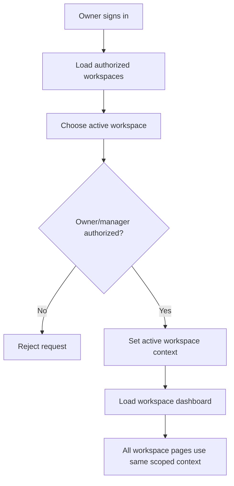

## 43.2 Billing aging

Billing must expose not only `PAID` or `UNPAID`, but how long money has remained outstanding.

Owner Billing must surface:

    Total Outstanding

    Current
    1-30 days
    31-60 days
    61-90 days
    90+ days

Example:

    Total Outstanding     Rs.84,500
    Current               Rs.32,000
    1-30 days             Rs.21,500
    31-60 days            Rs.18,000
    61-90 days             Rs.8,000
    90+ days               Rs.5,000

The owner must be able to drill into an aged balance:

    Resident     Unit     Amount     Overdue
    Rahul        203      Rs.13,780  12 days
    Aman         104      Rs.18,200  37 days
    Priya        301      Rs.11,500  74 days

Authoritative `overdue_days` must be calculated server-side from the stored due date and a defined current-date rule. The browser clock is never authoritative.

The aging calculation must remain consistent across owner dashboards, resident bill detail, platform-admin views, reports, APIs, and tests.

### Billing aging flow

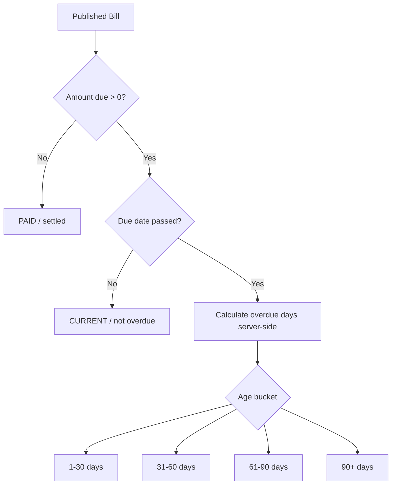

## 43.3 Monthly billing cycle

A monthly billing cycle is a first-class operational workflow, not merely a date filter over bills.

The owner should be able to see cycle progress such as:

    March 2026
    Status: OPEN

    Meter readings: 42 / 48
    Bills generated: 39 / 48
    Bills published: 35 / 48
    Collected: Rs.4,82,000 / Rs.6,10,000

The cycle should expose exceptions before publication. Examples:

    Missing reading
    Invalid reading
    No active lease
    Missing rent
    Missing tariff
    Duplicate bill attempt
    Unresolved correction

A future cycle can move through:

    OPEN -> READINGS_COMPLETE -> BILLS_GENERATED -> REVIEW -> PUBLISHED -> CLOSED

Exact states should follow existing project conventions and should not create unnecessary workflow complexity.

### Monthly billing-cycle flow

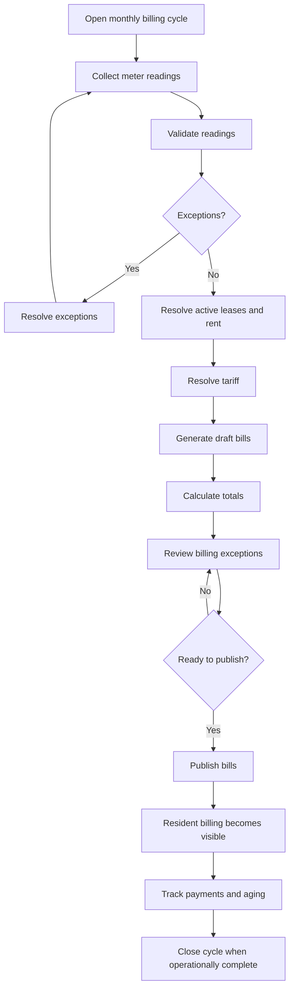

## 43.4 Meter-reading proof

Meter readings should optionally support an image attachment as evidence. This is a usability/audit feature, not OCR. OCR is explicitly deferred.

For a reading:

    Meter: ELEC-203
    Previous reading: 12,450
    Current reading: 12,610
    Consumption: 160 units
    Reading date: 31 Mar 2026
    Evidence: meter image (optional)

The image, where supported, must remain associated with the specific meter reading. It must not be replaceable in a way that destroys the audit history without an explicit correction/audit operation.

The resident may view the proof if product/privacy rules permit, but the owner remains responsible for entering the reading. Platform admin may inspect it under existing operator permissions.

### Meter-reading proof flow

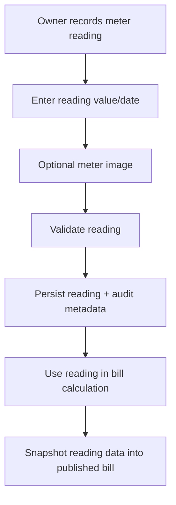

## 43.5 Bill dispute and correction workflow

Published financial records must not be freely editable. Errors must be corrected through an explicit workflow.

Example:

    Original reading: 12,610
    Corrected reading: 12,160
    Reason: "Meter reading entered incorrectly"

The correction flow should preserve:

    original value
    corrected value
    reason
    actor
    timestamp
    affected bill/payment state, if any

A correction may result in an adjustment, reversal, reissue, credit/debit entry, or other explicitly defined mechanism. Do not silently mutate the old financial history.

For MVP, the smallest coherent correction mechanism is preferred. The product may use an audited adjustment/revision path instead of building a full accounting ledger.

### Bill correction flow

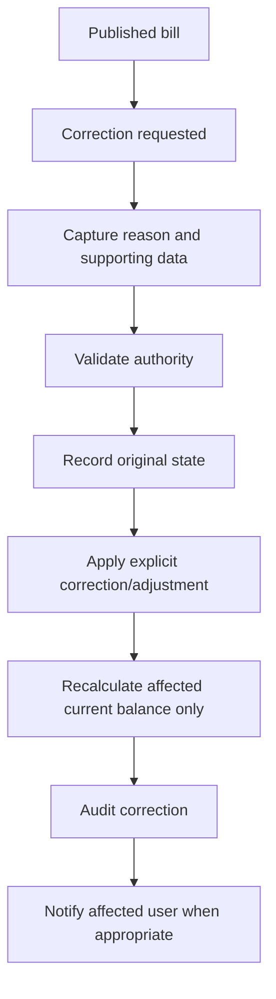

## 43.6 Notification center

Notifications become a first-class in-app surface for owners and residents. Initial delivery should be in-app; email/SMS are optional future delivery channels and must remain decoupled from billing correctness.

Resident notifications can include:

    Invitation received
    Invitation accepted/declined confirmation
    New bill published
    Payment received
    Receipt issued
    Bill overdue
    Correction/adjustment notice

Owner notifications can include:

    Resident accepted invitation
    Resident declined invitation
    New overdue bill(s)
    Monthly billing cycle incomplete
    Missing meter readings
    Payment received
    Receipt issued
    Billing correction event
    Plan limit reached or approaching

Notifications must be scoped to the authenticated account and must never become a cross-user information leak.

### Notification flow

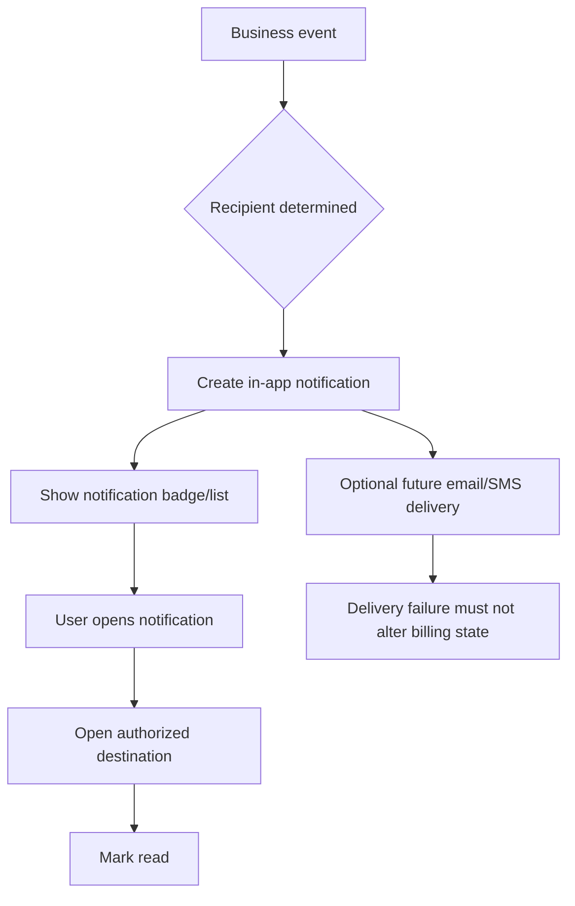

## 43.7 Invitation and membership acceptance

An owner must not be able to silently add an arbitrary existing user into a workspace. Invitations require explicit user action.

Flow:

    Owner selects user/contact
        -> Invitation created
        -> Recipient receives Notifications item
        -> Accept OR Decline
        -> only Accept activates membership

Before acceptance:

    membership = PENDING
    no property data access
    no workspace billing access
    no subscription access

After acceptance:

    membership = ACTIVE
    resident/member navigation becomes available
    Subscription is hidden/blocked
    Billing becomes available

### Invitation flow

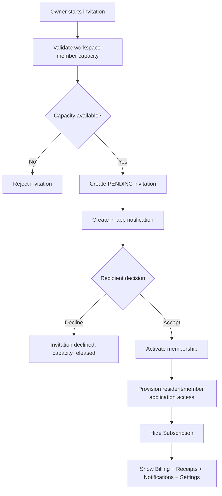

## 43.8 Owner onboarding wizard

A first-time workspace owner should be guided rather than dropped onto an empty dashboard.

Recommended onboarding:

    Step 1: Create Workspace
    Step 2: Create Property
    Step 3: Add Units
    Step 4: Invite Residents
    Step 5: Configure Electricity Rate
    Step 6: Ready to create bills

Display setup progress, but do not block experienced owners unnecessarily. A user may skip non-critical steps and return later.

### Owner onboarding flow

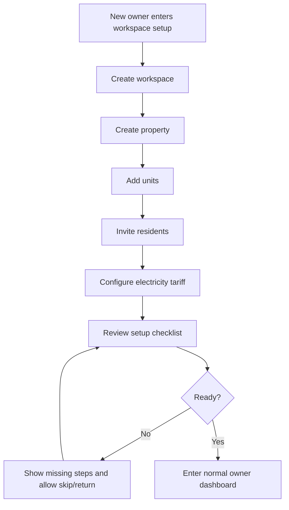

## 43.9 Plan usage meter

Plan limits must be visible in-product. The owner should not discover a limit only after an API rejection.

Basic:

    Workspaces  2 / 2
    Current workspace members  9 / 10

Pro:

    Workspaces  6 / 20
    Current workspace members  19 / 20

Recommended UI states:

    Healthy capacity
    Approaching limit
    Limit reached

The backend remains authoritative. The UI simply explains the current quota.

### Plan usage flow

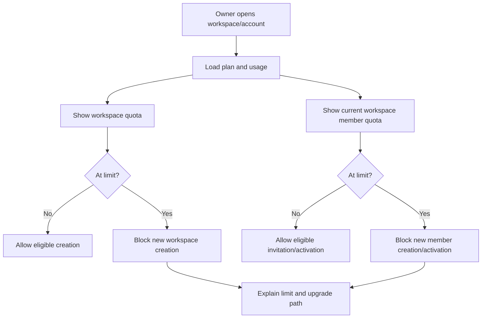

## 43.10 Workspace-level billing summary

Every workspace should have a billing summary that makes its financial state understandable without opening every bill.

Example:

    March 2026

    Billed                Rs.6,42,500
    Collected             Rs.5,98,200
    Outstanding             Rs.44,300
    Overdue                 Rs.28,900

    Residents                      48
    Bills issued                   48
    Bills paid                     41
    Bills unpaid                    7

    Electricity
    Total consumption          8,420 units

The owner can drill down:

    Workspace
      -> Property
        -> Unit
          -> Resident
            -> Billing History

Platform admin can use the same hierarchy across workspaces under global authorized views.

### Workspace billing-summary flow

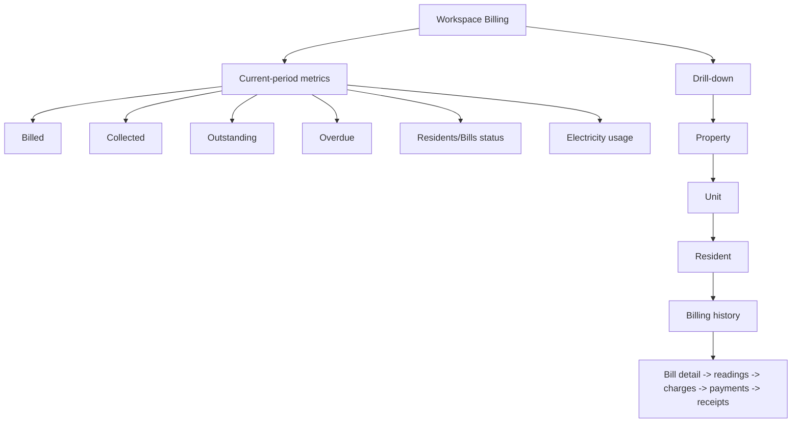

## 43.11 Owner and resident navigation

The product must make role separation obvious in the UI.

### Owner navigation

    Dashboard
    Workspaces
    Properties
    Units
    Residents
    Meters
    Billing
    Payments
    Receipts
    Reports
    Notifications
    Subscription
    Settings

### Resident navigation

    Dashboard
    My Bills
    Billing History
    Receipts
    Notifications
    Settings

No resident Subscription navigation item is permitted after membership acceptance. Direct backend access must also be denied.

### Platform-admin navigation

Existing platform navigation remains authoritative and is extended with authorized global property billing visibility, subscription controls, user/owner controls, and audit visibility.

### Navigation decision flow

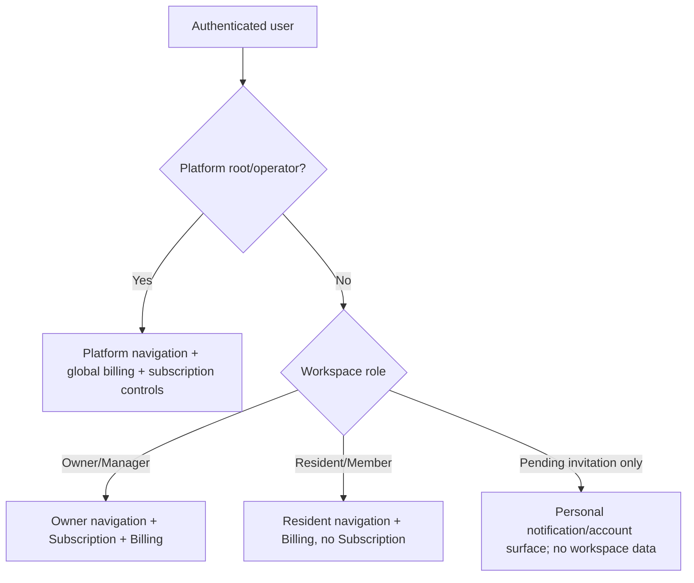

## 43.12 Workspace/ownership lifecycle

The intended lifecycle is:

    Account
      -> create workspace
      -> subscribe to Tenora plan
      -> manage workspaces
      -> manage properties
      -> manage residents
      -> manage billing

A user who is currently a resident can become a landlord without deleting their account:

    Resident
      -> Leave Workspace
      -> no active resident membership in that workspace
      -> Create Workspace
      -> subscribe/activate eligible plan
      -> become Workspace Owner

Account deletion remains a separate destructive action.

### Resident-to-owner flow

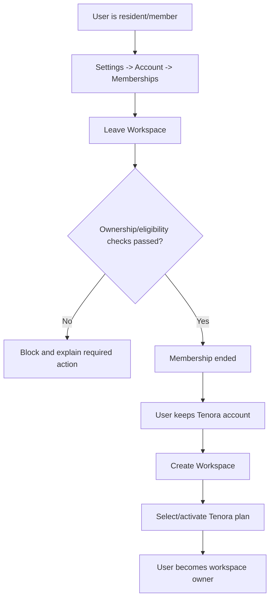

## 43.13 Account deletion flow

Actual account deletion remains available under:

    Settings
      -> Account
        -> Manage Account
          -> Delete Account

Deletion must be intentionally destructive, confirm the user's intent, invalidate active authentication sessions/tokens as appropriate, and preserve/anonymize historical financial data according to retention rules. It must not be a mechanism for bypassing plan limits or escaping financial obligations.

### Account deletion flow

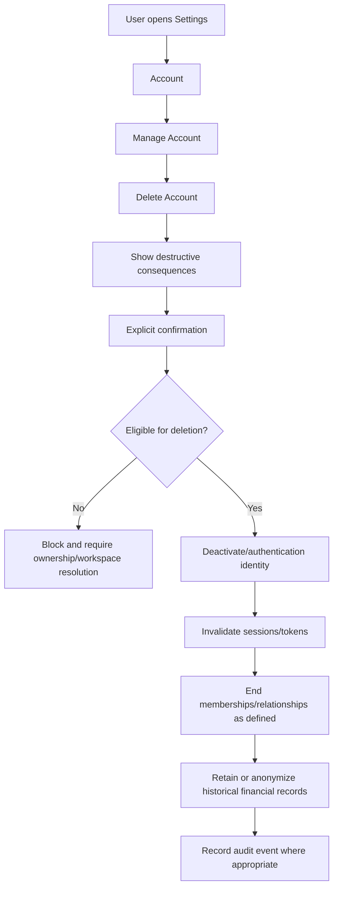

## 43.14 Workspace roles and future delegated access

The architecture must be role-ready even if the first release exposes only Owner/Resident/Platform Admin.

Recommended future delegated roles:

    Workspace Owner
      -> full workspace management

    Property Manager
      -> properties, units, residents, leases, readings, bills

    Accountant
      -> billing, payments, receipts, reports

    Resident
      -> own billing/profile/notifications only

Do not implement every delegated role unless required by the current scope, but avoid hard-coding authorization so tightly around a single `is_owner` boolean that adding manager/accountant roles later requires a rewrite.

### Future role flow

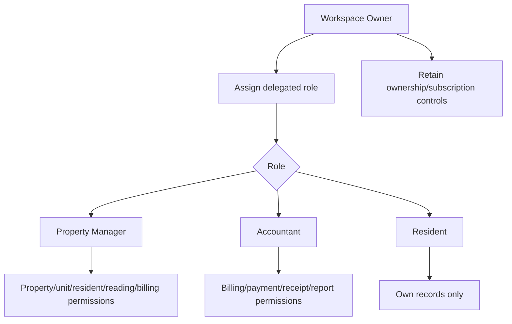

## 43.15 Master financial separation flow

This is the most important conceptual flowchart in the product.

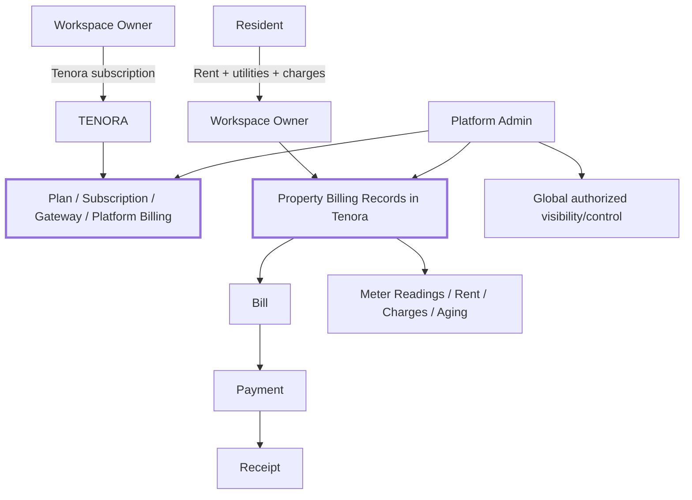

The gateway can be reused at infrastructure level, but these are separate financial domains and must remain separate in data ownership, permissions, service logic, and reporting.

## 43.16 Master end-to-end product flow

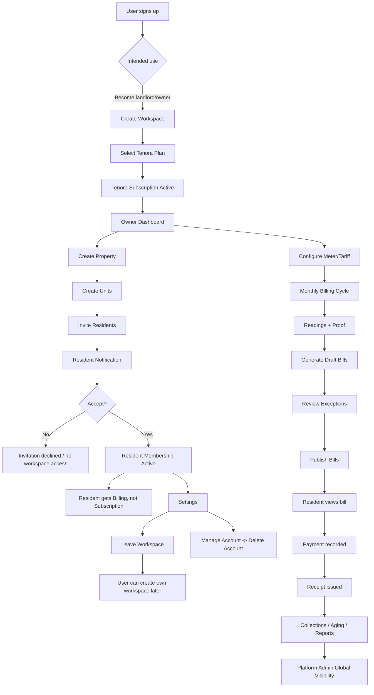

## 43.17 Master entity and access hierarchy

```text
TENORA PLATFORM
│
├── Platform Admin / Root
│   ├── Global subscription visibility/control
│   ├── Global property billing visibility
│   ├── Promote/demote owners regardless of plan
│   └── Audit/control plane
│
├── Workspace Owner A
│   ├── Tenora Subscription
│   ├── Workspace 1
│   │   ├── Property
│   │   │   ├── Unit
│   │   │   │   └── Resident
│   │   │   │       ├── Lease
│   │   │   │       ├── Rent
│   │   │   │       ├── Meter
│   │   │   │       ├── Meter Readings
│   │   │   │       ├── Bills
│   │   │   │       ├── Payments
│   │   │   │       └── Receipts
│   │   │   └── ...
│   │   ├── Billing Aging
│   │   ├── Monthly Billing Cycle
│   │   ├── Notifications
│   │   └── Settings
│   │
│   └── Workspace 2
│       └── same structure, independently scoped
│
└── Workspace Owner B
    └── independently isolated workspaces
```

## 43.18 Product-quality acceptance checklist

Before considering the expanded product domain complete, verify all of the following:

- workspace switcher works without logout/re-authentication
- owner sees only authorized workspaces
- billing aging shows deterministic overdue duration
- monthly billing cycle shows progress and exceptions
- meter readings optionally retain image proof
- published bills require explicit correction workflow for changes
- notifications cover invitations and core billing events
- owner onboarding guides first-time setup
- plan usage is visible and matches server-side counters
- workspace billing summary exposes billed/collected/outstanding/overdue values
- owner navigation contains Subscription and Billing
- resident navigation contains Billing and no Subscription
- invitation acceptance is required for workspace access
- resident cannot access another resident's billing data
- owner can leave/manage eligible memberships without deleting their account
- owner/resident account deletion remains a separate destructive action
- architecture is ready for delegated roles without rewriting tenancy boundaries
- platform admin retains global authorized visibility and promote/demote controls
- all flow-critical backend operations remain protected by services, constraints, permissions, and audit rules

---

# 44. Final Instruction to Claude Code

Treat this document as the property billing/product-domain master plan.

Do not simply implement the wording literally where it conflicts with the current repository's established architecture. First inspect the actual codebase and reconcile this specification with existing Tenora models and infrastructure.

When a conflict is found:

1. preserve established security/tenant-isolation invariants
2. preserve existing platform subscription semantics
3. preserve backward compatibility where practical
4. choose the smallest coherent change
5. document the decision in the implementation report

The final implementation must make the conceptual separation crystal clear:

    TENORA SUBSCRIPTION
    Workspace Owner -> Tenora

    PROPERTY BILLING
    Resident -> Workspace Owner

    PLATFORM ADMIN
    sees authorized data across both domains

The system should ultimately support this end-to-end experience:

    Owner signs up for Tenora
        -> creates/owns workspace
        -> subscribes to Tenora plan
        -> creates property
        -> creates units
        -> adds residents
        -> creates leases
        -> configures electricity tariff
        -> records meter readings
        -> generates monthly bills
        -> publishes bills
        -> records resident payments
        -> issues receipts
        -> reviews collections/outstanding balances

    Resident signs in
        -> sees own unit
        -> sees own monthly bills
        -> sees electricity usage
        -> sees payment status
        -> sees/downloads own receipts

    Platform admin signs in
        -> sees workspaces
        -> sees platform subscriptions
        -> sees property billing data across workspaces
        -> can inspect billing/payment/receipt records subject to existing root/operator controls

That is the target product architecture.
